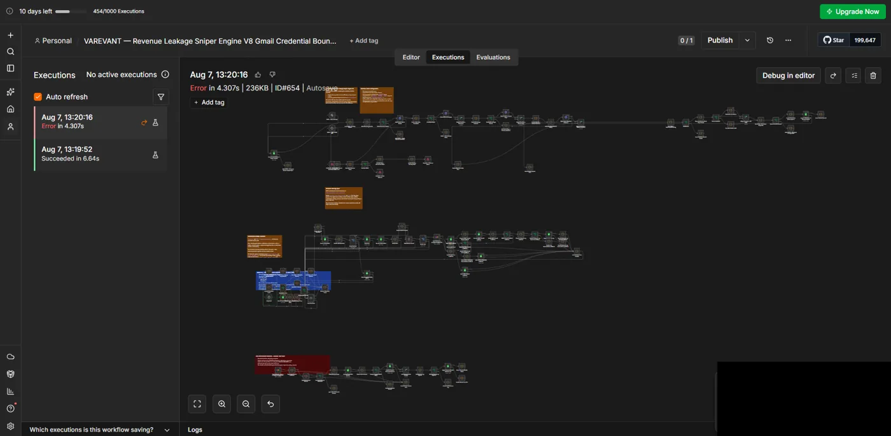
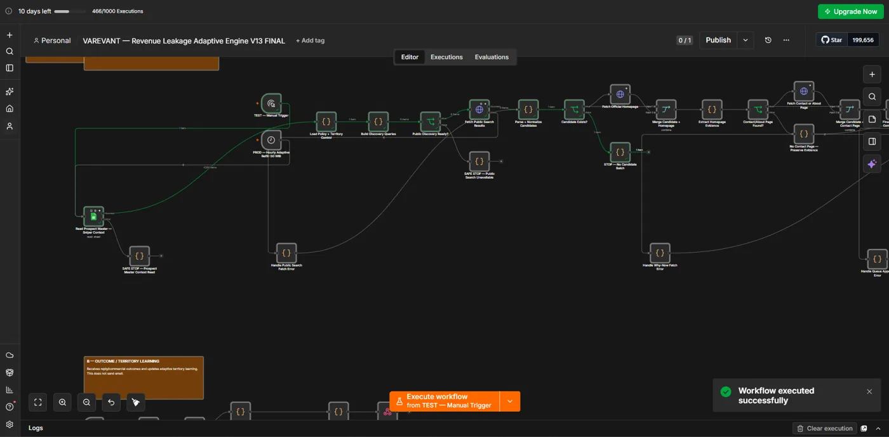
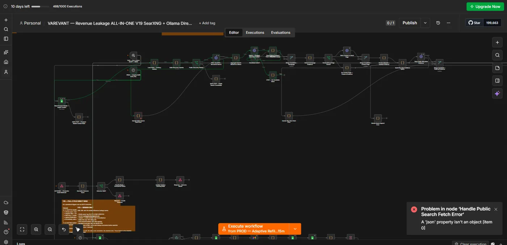
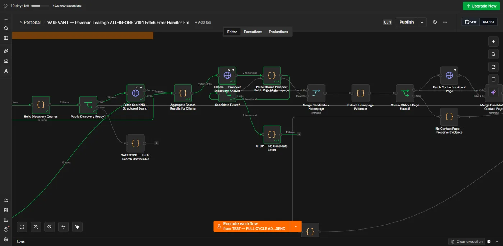
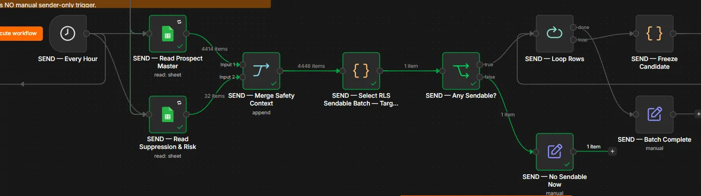

# Historical n8n Evidence

Five historical VAREVANT screenshots show execution history, a successful manual test, a visible failure, and discovery/routing paths. Open an image to inspect its details.

> These screenshots document separate historical VAREVANT workflows. They do not represent execution of the inactive synthetic n8n demo included in this repository, and they make no claim about production traffic, uptime, client impact, or business outcomes.

## 1. Workflow architecture — privacy review pending

The supplied master workflow capture is **MANUAL_REDACTION_REQUIRED**: sender identity remains visible around the Gmail action and blue annotation. It is withheld rather than presented as public-safe evidence. The older corrupt master file has been removed from the current gallery.

## 2. Execution history

Sanitized historical n8n execution history showing one succeeded run and one failed run with timestamps and durations.

- Aug 7, 13:19:52 — Succeeded in 6.64s.
- Aug 7, 13:20:16 — Error in 4.307s.

The successful run precedes the failed run; this is not after-fix recovery evidence. Two visible records and an account quota counter do not establish aggregate production metrics.

## 3. Successful manual test

Sanitized historical manual n8n test run showing an executed node path and the UI’s successful-execution confirmation.

The manual trigger and green path reach `STOP — No Candidate Batch`; the UI says `Workflow executed successfully`. This verifies completion of the visible test, not email delivery, execution of every branch, or runtime validation of this repository's synthetic demo.

## 4. Failed execution

Sanitized historical n8n error capture showing the failing handler and the exact payload-shape error.

The UI identifies `Handle Public Search Fetch Error` and reports `A 'json' property isn't an object [item 0]`. The failure is visibly surfaced. Its business impact and subsequent recovery are unknown; a node label containing `PROD` does not establish production context.

## 5. Discovery execution path

Sanitized historical discovery path showing executed search, aggregation, candidate processing, and a no-candidate stop branch.

Green node states and item counts are visible. The title includes a later revision and a fix label, but the capture does not demonstrate that the previously failing handler ran successfully. No after-fix recovery claim is made.

## 6. Routing execution path

Executed historical n8n routing segment showing merged input counts, sendability selection, and a no-send fallback path.

- Prospect Master shows 4,414 items; Suppression & Risk shows 32; the merge shows 4,446.
- The selection step outputs one item; `Any Sendable?` takes its false branch to `No Sendable Now`.
- The loop and freeze nodes are visible but not shown as executed.

These are UI item counts, not verified unique people, clients, or messages sent. The screenshot does not expose the selection code or establish correctness of its rules.

## Evidence matrix

| Evidence | Verified | Not verified / boundary |
| --- | --- | --- |
| Full master workflow capture | NO — withheld | Further privacy redaction required |
| Execution history | YES | Two visible records; not aggregate reliability |
| Execution timestamps and durations | YES | History capture only |
| Successful manual test | YES | Visible test completion; not all branches or delivery |
| Failed execution detail | YES | Named handler and visible error; no impact claim |
| Discovery and routing execution | YES | Visible nodes, states, and item counts only |
| After-fix recovery | NO | Same failing path later succeeding is not established |
| Reusable sub-workflow | NO | Not established by these screenshots |
| Production traffic, uptime, aggregate metrics | NO | Not established by screenshots |
| Client impact, revenue impact, business outcomes | NO | No supporting evidence |
| Runtime validation of synthetic demo | NO | Import, credential binding, and execution remain separate |

## Source integrity and privacy

The sole image source for this gallery is the supplied `n8n_evidence_final.zip`. The five published WebP files are byte-for-byte copies of its entries: no further redaction, cropping, recompression, reconstruction, or generation was performed. Their existing sanitization was supplied with the archive. Visual review found no readable sensitive values in the five accepted captures; the master capture was excluded for the remaining sender identity.

Older gallery copies, including the corrupt master and duplicate routing views, are no longer used. Screenshot filenames retain the archive's numbering; gallery order follows the review sequence above.

## Other inspectable proof

- [Tests](../../tests/) and [GitHub Actions](https://github.com/naraya07pedro-spec/production-integration-reference/actions/workflows/ci.yml) cover the TypeScript/PostgreSQL reference using synthetic fixtures.
- [Inactive synthetic n8n demo](../../n8n/README.md) documents its setup and runtime boundary.
- [Historical debugging case](../debugging-case.md) documents a separate repository state-management bug, not recovery from an n8n failure.
