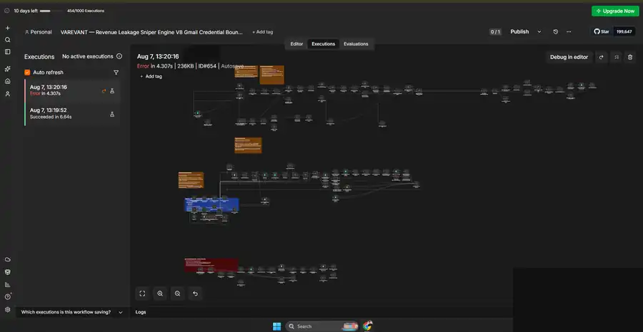
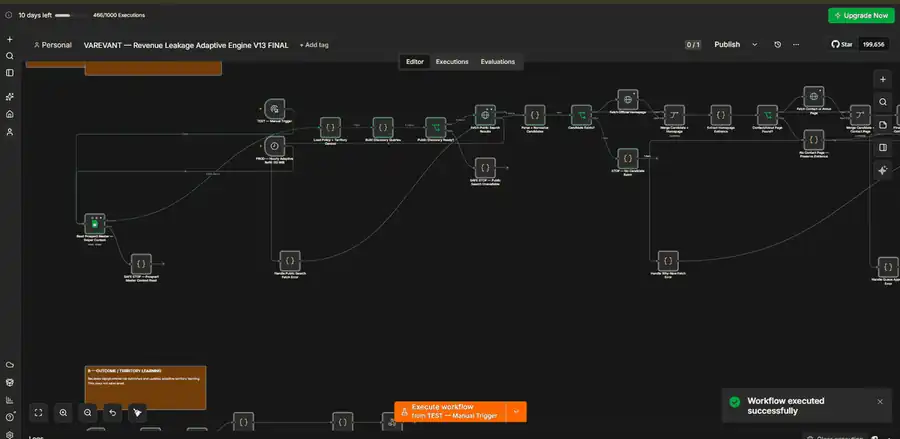
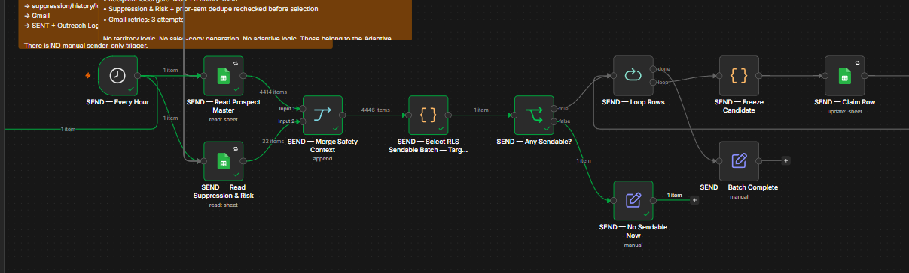
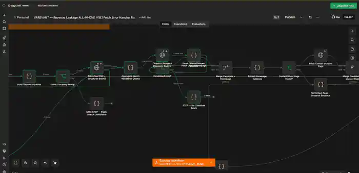
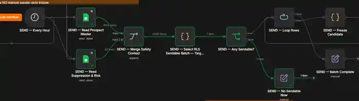

# Historical n8n Evidence

This page contains public-safe historical evidence from separate VAREVANT n8n workflows.

> These screenshots document separate historical VAREVANT workflows. They do not represent execution of the inactive synthetic n8n demo included in this repository, and they make no claim about production traffic, uptime, client impact, or business outcomes.

## 1. Workflow architecture

Sanitized historical n8n workflow showing dispatcher lease control, live re-validation, claim verification, routing, Gmail action boundaries, and explicit error branches.

**What this verifies**

- A non-trivial orchestration surface with scheduled dispatch, re-read/validation steps, routing, send boundaries, logging, and error paths.
- Explicit duplicate-hold and claim-verification controls are visible.
- The screenshot shows architecture and node relationships; it does not prove the correctness of every rule or any production-scale outcome.

## 2. Execution history

Sanitized historical execution view showing one successful run and one failed run with visible timestamps and durations.

**What this verifies**

- Aug 7, 13:19:52 — Succeeded in 6.64s.
- Aug 7, 13:20:16 — Error in 4.307s.
- Success and failure were surfaced in the n8n execution UI rather than inferred from the workflow canvas.

This does not establish aggregate production traffic, uptime, reliability percentages, or business impact.

## 3. Successful test execution

Sanitized historical manual n8n test run showing an executed node path and the UI's "Workflow executed successfully" confirmation.

**What this verifies**

- A real historical manual execution reached a successful n8n completion state.
- The visible green path shows which portion of the workflow executed in that run.

It does not establish that every branch, scheduled run, external side effect, or production workflow succeeded.

## 4. Failed execution

Sanitized historical n8n error capture showing the failing handler and the exact visible payload-shape error:

"A 'json' property isn't an object [item 0]"

**What this verifies**

- A workflow failure was surfaced at a named error-handling node.
- The failure reason was inspectable in the n8n UI.

This is evidence of a historical failure state, not evidence of customer impact, financial loss, or a production incident.

## 5. Executed routing path

Executed historical n8n routing segment showing merged input counts, deterministic sendability selection, and a no-send fallback path.

**What this verifies**

- The visible executed path reads 4,414 items from Prospect Master and 32 from Suppression & Risk, then merges 4,446 items.
- The selection step outputs one item.
- "Any Sendable?" takes its false branch to "No Sendable Now".

These are n8n UI item counts, not verified unique people, clients, messages sent, or production traffic.

## 6. Later-version discovery execution

Sanitized historical discovery execution on a later workflow version showing an executed candidate-discovery path.

This is useful as additional operational evidence, but it is **not presented as verified recovery from screenshot 04** because direct before/after lineage is not established by the available screenshots.

## 7. Routing detail

Sanitized close-up of executed sendability routing showing 4,414 + 32 inputs merged to 4,446 items, one selected item, and the no-send fallback branch.

This is a closer view of the same routing evidence represented in section 5, included for technical readability rather than as a separate claim.

## Evidence matrix

“Verified” below means inspectable in the published repository.

| Evidence | Verified | Boundary |
| --- | --- | --- |
| Historical n8n workflow architecture | YES | Architecture does not prove every rule is correct |
| Execution history with timestamps/durations | YES | Two visible runs only; not aggregate reliability |
| Successful test execution screenshot | YES | Manual historical run; not whole-system production proof |
| Failed execution screenshot | YES | Failure visible; no business-impact claim |
| Historical routing execution | YES | UI item counts only |
| Later-version discovery execution | YES | Not claimed as verified recovery from the failed run |
| After-fix recovery | NO | Direct before/after lineage is not established |
| Reusable sub-workflow screenshot | NO | Not established by the published set |
| Aggregate production metrics | NO | No verified aggregate dataset |
| Production traffic / uptime | NO | Not established by screenshots |
| Client impact / business outcomes | NO | Not established by screenshots |
| Runtime validation of synthetic demo | NO | Import, credential binding, and n8n execution remain separate |

## Evidence integrity and privacy

Publication copies only remove or hide browser chrome, account-specific URLs/IDs, sender/account text, and an OS notification where present. Workflow nodes, connections, execution states, timestamps, durations, item counts, and error text were not edited.

The screenshots are intentionally presented as **historical VAREVANT workflow evidence**. They remain separate from the [inactive synthetic n8n demo](../../n8n/README.md), which exists as a public-safe authored reference and is not represented here as a runtime-validated production export.

## Other inspectable proof

- [TypeScript source and tests](../../tests/) plus [GitHub Actions](https://github.com/naraya07pedro-spec/production-integration-reference/actions/workflows/ci.yml) cover the standalone TypeScript/PostgreSQL reference using synthetic fixtures.
- [Inactive synthetic n8n demo](../../n8n/README.md) documents its setup and runtime boundary.
- [Historical debugging case](../debugging-case.md) documents a separate repository state-management bug with public commit evidence.
